# Delvers

Delvers is a roguelite guild-building RPG where you recruit adventurers, craft equipment from monster materials, discover permanent recipes, and send your party into dangerous multi-room expeditions. Every expedition strengthens your camp—not through endless stat inflation, but through new knowledge, new heroes, and new possibilities.

A crafting-driven dungeon crawler built with [Godot 4.6](https://godotengine.org/). Lead your delvers through escalating dungeon rooms, hunt monsters for **materials and recipes**, and grow your camp's knowledge — combat resolves in a headless simulation and replays as a low-poly 3D theater scene built entirely from procedural rigs.

## Trailer

**[Watch: Delvers — Chapter One: The Darkwood (vertical slice)](https://youtu.be/40jkvYQuu3A)**

[](https://youtu.be/40jkvYQuu3A)

Fifty-six seconds, captured entirely from the live game: the abandoned camp, the Darkwood, poison and arrows, a recovered treatise, the Virulent Iron Sword forged, the Slime King slain, the banner rising — and a stranger at the fire. (Re-render it anytime: `capture/trailer_shot.tscn`, then `capture/make_trailer.sh`.)

## Screenshots

| Main menu | The camp |
|-----------|----------|
|  |  |


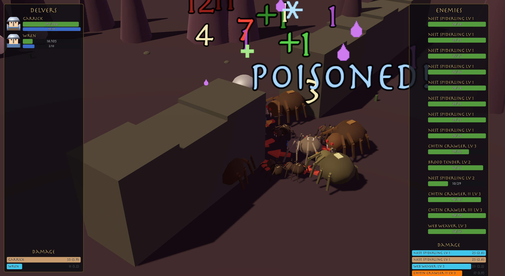

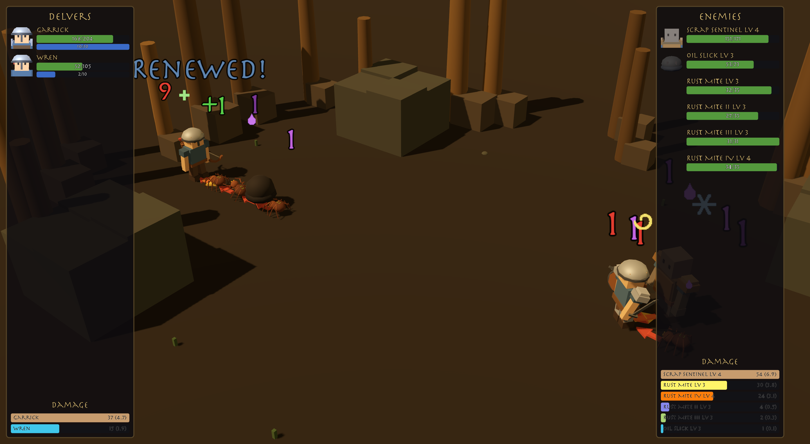

| Hero loadout & mastery | The Forge |
|------------------------|-----------|
|  | 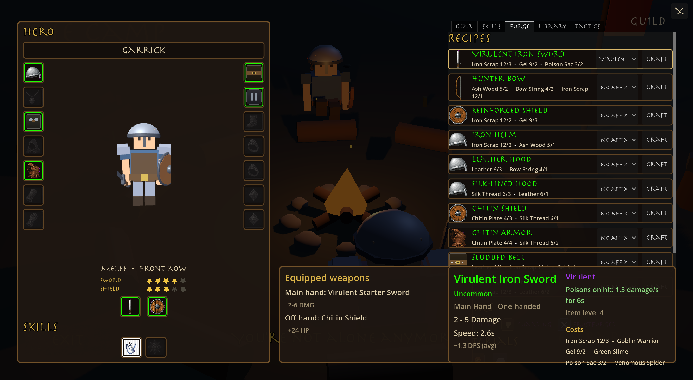 |

| The Library | Tactics & the Doctrine Editor |
|-------------|-------------------------------|
| 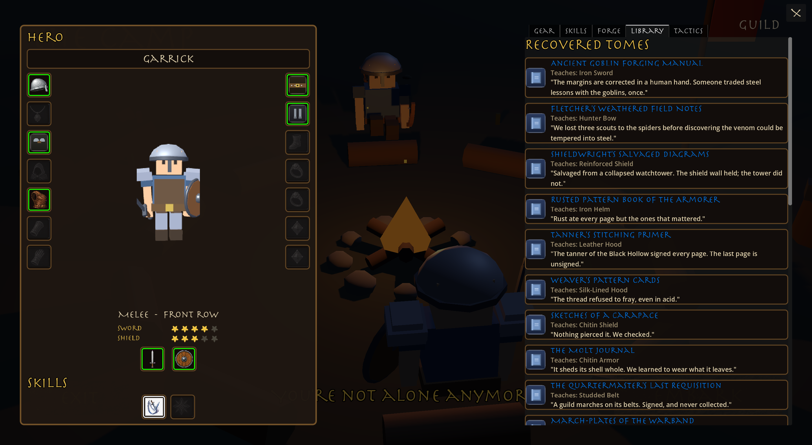 | 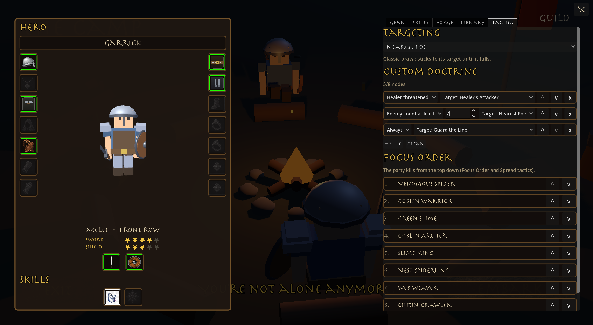 |

| The Guild |
|-----------|
| 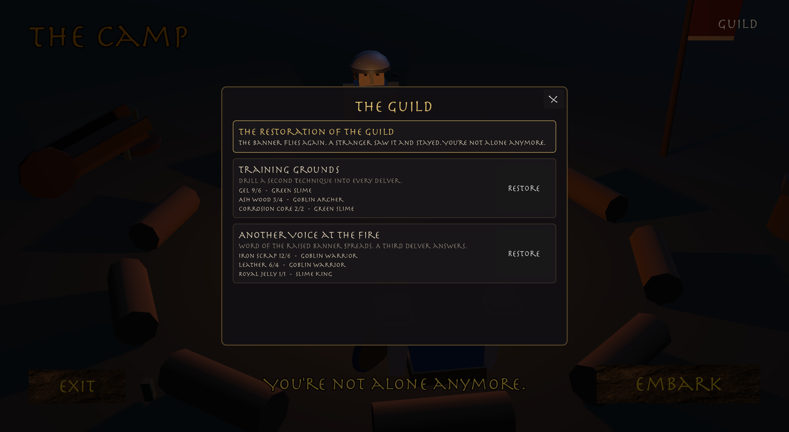 |

## In Motion

**From the menu into camp** — the camera glides from the title framing down to the fire:

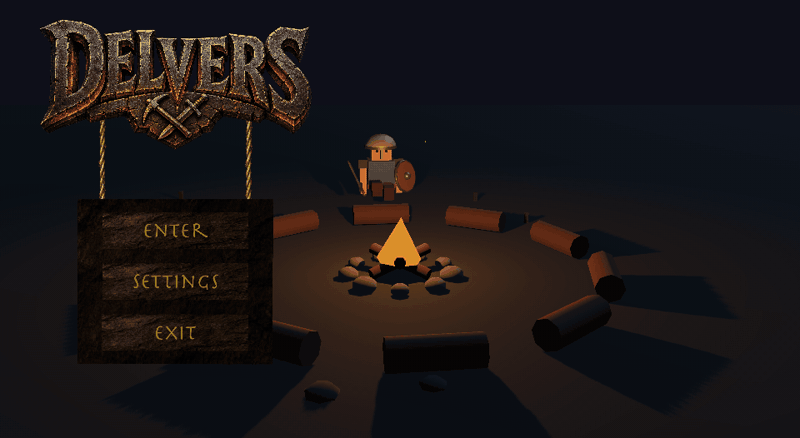

**A delve room** — pathfinding around pillars, target arrows, swings landing on the damage beat, floating numbers, slimes hopping in:

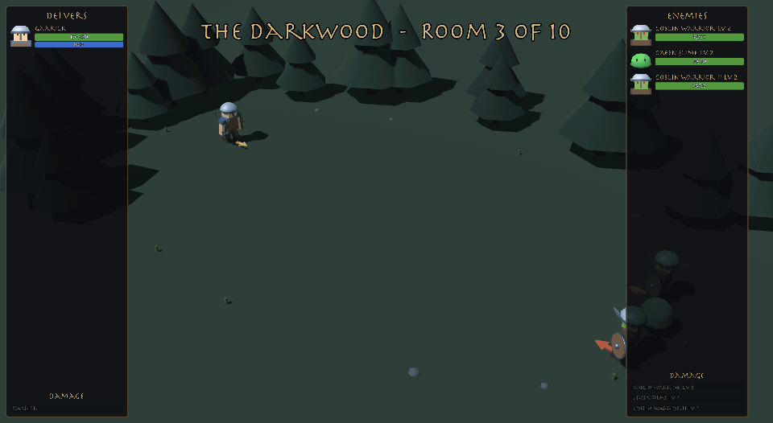

## Meet the Cast

| Fresh recruit (melee) | Fresh recruit (archer) | Veteran, fully kitted |
|:--:|:--:|:--:|
| 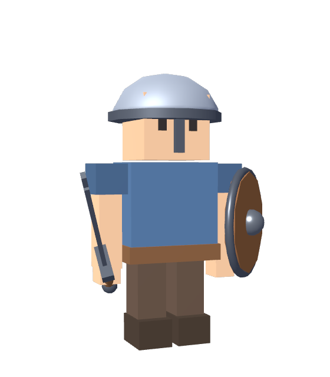 | 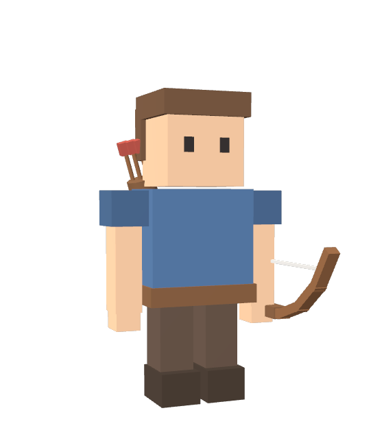 | 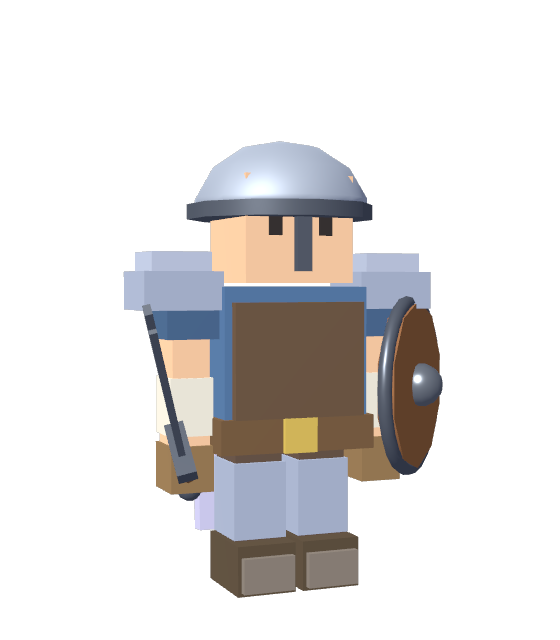 |
| One sword, one recipe | Wren arrives after the banner rises | Every worn slot renders on the body |

**The Darkwood** — its threat is steel; its gear is armor:

| Goblin Archer | Goblin Warrior | Green Slime | Venomous Spider | Slime King |
|:--:|:--:|:--:|:--:|:--:|
| 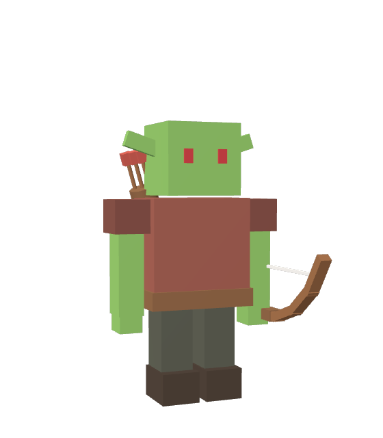 | 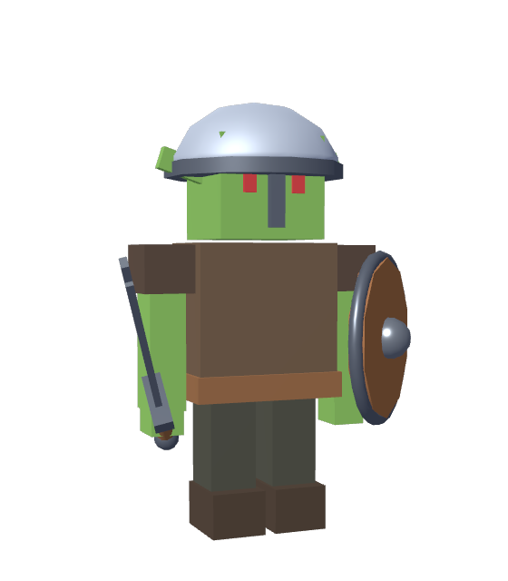 | 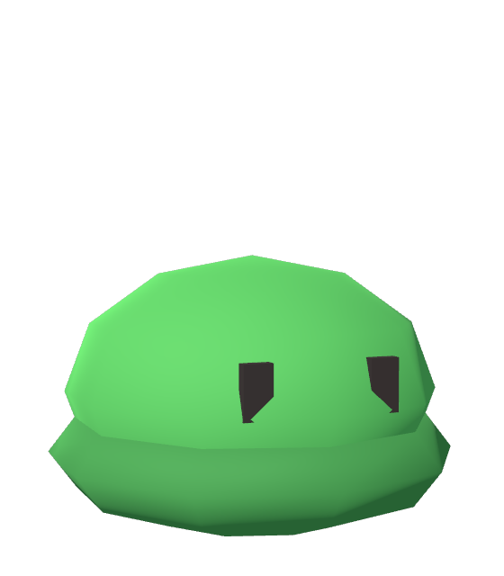 | 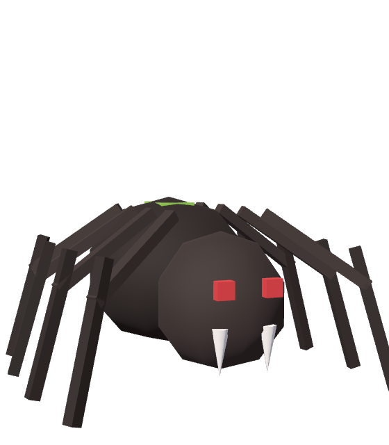 | 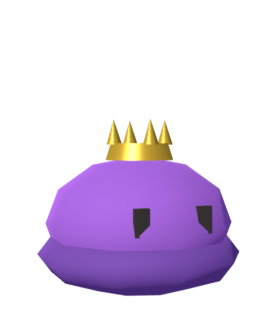 |
| Owns wood & strings | Owns iron & leather | Owns gel & ooze | Owns poison | Boss; guards the map below |

**The Spider Nest** — its poison ignores armor; its gear resists it. Its lesson: kill the spawner or drown:

| Nest Spiderling | Web Weaver | Chitin Crawler | Brood Tender | The Broodmother |
|:--:|:--:|:--:|:--:|:--:|
| 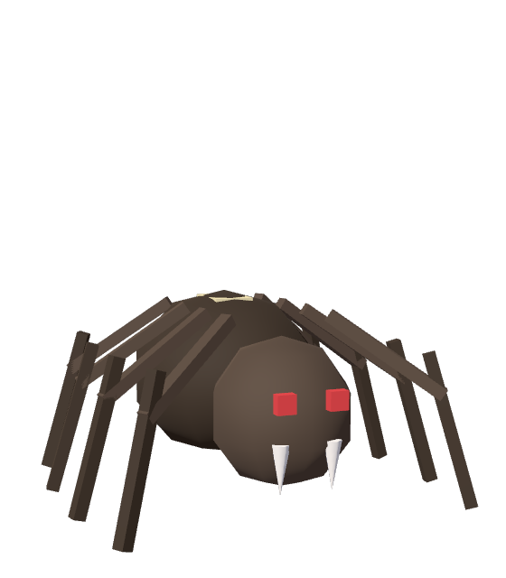 | 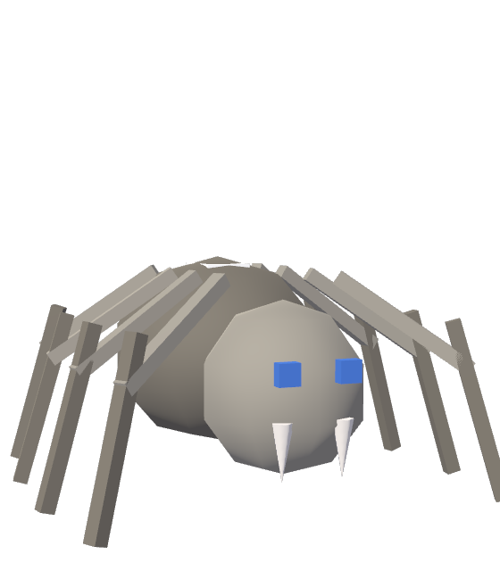 | 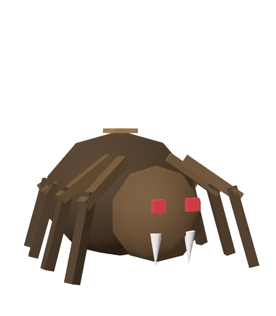 | 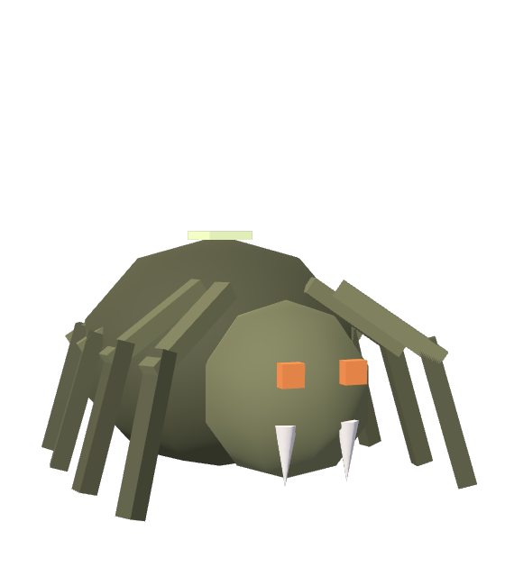 | 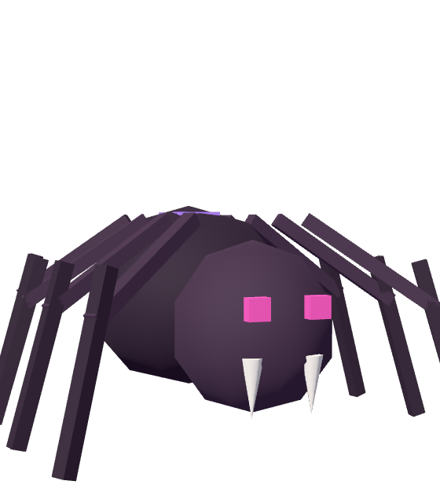 |
| The swarm | Its silk roots you | Armored; owns chitin | Births spiderlings mid-fight | Boss of the deep |

## Features

- **Spatial combat simulation** — Heroes and enemies fight on a tile-based battlefield: units path toward their targets (A* + soft separation), attacks are gated on weapon/skill range and line of sight, ranged attacks wind up standing still, and enemies pick targets from threat tables. Combat runs headlessly and produces a full event log.
- **3D theater playback** — Combat results replay in a low-poly 3D battle scene built entirely from procedural primitive-mesh rigs: units walk (or hop) along their logged paths, melee swings land on the damage beat, archers draw and loose visible arrows, deaths crumple into corpses, and target arrows + floating damage numbers keep it readable. A camera follows the fight.
- **Battle UI** — Side panels show each team's units (portrait, name, health and mana) plus a live damage/DPS meter, keeping the battlefield itself free of floating nameplates.
- **Data-driven everything** — Heroes, enemies, gear, skills, recipes, affixes, materials, and whole dungeons are Godot resources (`.tres`); the procedural rigs dress themselves from the data.
- **Discipline Mastery** — No classes: the worn loadout trains its disciplines (Sword, Shield, Bow, Restoration) one room at a time. Stars unlock core techniques (Cleave, Whirlwind, Multishot, Shield Wall...) that join combat automatically, plus small passives. Unpracticed disciplines rust — but the highest star ever earned never fades, and relearning is three times faster. Every delver's history is readable in their star rows.
- **Tactics & Battlefield Doctrines** — Per-hero targeting directives (Nearest Foe, Finish the Wounded, Focus Order, Spread the Venom, Guard the Line, Protect the Healer) recovered as doctrine tomes from the enemies that practice them, plus a party-wide sortable focus order listing only enemies the guild has faced. Once a Battlefield Doctrine tome grants node capacity, the **Doctrine Editor** opens: WHEN/THEN rules over the same behaviour-tree engine the built-in tactics run on — the seed of future visual-block and scripting interfaces.
- **Crafting & the knowledge economy** — Monsters drop resources and knowledge, never useful equipment: per-enemy material identities, recipes and affixes as named tomes with provenance and lore, expedition logs recovered in story order, and salvaging that teaches unknown enchantments. Boss trophies always carry an affix — wield it, or break it to learn it.
- **Dungeons with lessons** — Each dungeon has a threat, an answer found inside it, and a lesson: the Darkwood's steel is answered by armor; the Nest's armor-ignoring poison by resist gear, its Brood Tenders by focus fire and AoE. Difficulty tiers (unlocked by clearing) raise foes and spoils — materials, rarity odds, tier-gated recipes — never raw item level.
- **The Guild** — First victory raises the banner and the first companion sits down at the fire. Material-funded restoration unlocks skill slots and delvers; the camp itself visibly rebuilds (banner, anvil, training dummy) as the guild earns it.
- **Full game loop** — Main menu → camp → battle → back to camp. The camp and menu share a campfire stage where your unlocked heroes sit at random seats around a smoldering, animated fire that grows with the party's deeds. Soft ground shadows sit under every actor at camp and in battle. Entering camp from the menu plays a zoom-and-fade transition, and the party keeps their seats across it.
- **Hero loadout** — Click a hero at camp for their five-tab screen: Gear (live 3D preview, drag-and-drop or click-to-carry, tooltips with equipped comparison, a salvage bin), Skills (mastery-owned cores shown dimmed with their star requirements; guild techniques slot freely), Forge, Library, and Tactics. Worn gear renders on the body — pauldrons, cloak, plate, greaves, and the rest. Equipping a bow makes a back-row archer; dual-wielding staggers alternating swings; everything persists to disk.
- **Sound** — Procedurally synthesized placeholder audio: looping menu and combat themes, fire-crackle ambience, a creaking sign, UI hover/click feedback, and combat hits, swings, and bow shots. Mixed through Master/Music/SFX/Ambience buses.
- **Settings** — Fullscreen toggle and four volume sliders, persisted to disk and applied on startup.

## Game Design

### Vision

Delvers is a party-based dungeon crawler where you send heroes — your *delvers* — into dangerous places and watch them fight. You're running and growing an adventurers' guild: **materials are consumed, knowledge is permanent**, and every expedition brings home resources to build with or recipes that permanently expand what the camp can create. Tactical depth comes from party composition, gear/skill combinations, and crafting toward specific builds rather than direct real-time control — power comes from good combinations, not grinding.

### Core Loop (planned)

1. **Camp** — Recruit and equip delvers at the campfire hub.
2. **Delve** — Enter a dungeon and encounter enemy groups.
3. **Combat** — Battles resolve automatically via the simulation engine.
4. **Theater** — Results play back as a staged battle scene.
5. **Rewards** — Collect loot, experience, and progress deeper.

The loop is playable across **two dungeons and five difficulty tiers each**: found the guild with one delver and one recipe, delve the Darkwood's ten rooms to the Slime King, recover the map he guards, and descend into the Spider Nest — where the Broodmother waits behind swarms only focus fire and AoE survive. **Monsters drop resources and knowledge, never equipment**; the Forge turns them into the exact gear each dungeon demands; mastery grows in whatever your delvers practice; doctrines, affixes, expedition logs, and even tactical complexity itself are recovered, one tome at a time. The whole game is one long tutorial of a lost guild's knowledge — steady discovery, never a menu of futures. Everything persists to disk (and Settings can burn the ledger for a fresh founding day).

### Combat Design

Combat is **auto-battler** style: units act on attack timers rather than player input. Each entity has:

- **Health and mana** — Base stats from their template resource; health carries between delve rooms (attrition).
- **Attack interval** — How often they swing. For heroes, the main-hand weapon's swing speed sets this interval when equipped.
- **Position and movement** — A spot on the battle grid; units path toward targets with A* and soft separation, and stop at striking distance.
- **Skills** — Fifteen data-driven techniques with ranges, cooldowns, mana, statuses, and behavior scripts — from Cleave and Whirlwind through Thunderclap (AoE daze + triple threat), Renew, Shield Wall, Multishot, Piercing Shot, Battle Shout, and Rally. Core techniques are earned through mastery; guild techniques slot freely.

Damage is rolled as `base_attack + random(skill.min_damage, skill.max_damage)` for skills, plus a per-swing weapon damage roll for equipped weapons. Combat ends when one side is wiped out.

**Spatial targeting** — Attacks are gated on weapon/skill range and line of sight: melee closes in before swinging, archers stop and wind up in place, and nobody shoots through pillars. Enemies pick targets from **threat tables** (damage and heals generate threat; a rooted enemy falls through to whoever is in range), while heroes follow their tactic — or their hand-written doctrine.

**The delve** — Ten rooms of escalating packs and enemy levels across an arena pool (open field, pillared hall, choke-point wall, scattered rocks), ending at the Slime King. Every enemy rolls a level that scales its health and attack, shown in its name (e.g. *Green Slime Lv 2*). Rooms flow into each other automatically; death or triumph banks the spoils either way.

**Loadout and roles** — A hero's combat role is driven by what they wield. Equipping a bow assigns the Arrow Shot skill and a back-row slot; equipping a one-handed weapon assigns Slash and a front-row slot, and bows/two-handers free the off-hand. Gear lives in a shared stash (each item is a single physical object), skills are a known catalog, and every change a hero makes is read directly off its template by the next battle. Everything persists to disk.

**Weapon speed and dual-wield** — Each weapon has a damage range (e.g. 1–3) and a swing speed in seconds. Per-hit damage is rolled from that range; listed DPS uses the average. Faster weapons hit more often with smaller rolls; slower weapons hit harder per swing. Weapons are tuned so similar item levels land in a comparable DPS band, leaving room for future trade-offs (armor stats, procs, etc.). A one-handed weapon in the off hand swings on the same timer at 50% of its rolled damage, so dual-wielding trades shield or stat slots for extra attacks. In the theater replay, off-hand strikes jump to melee range and play a quick mirrored swing from the off-hand weapon — independent of the main-hand animation.

A key architectural choice is **separating simulation from presentation**:

```
CombatState (simulate) → CombatLog / CombatResult → TheaterController (replay)
```

This lets combat run instantly in the background (useful for fast-forward, AI testing, or server-side resolution) while the player watches a polished replay. The two layers communicate only through serializable events (`SPAWN`, `DAMAGE`, `DEATH`), keeping them independent.

### Content Pipeline

New content is data plus (sometimes) a small behavior script:

1. **Enemies** — a template `.tres` (stats, skills, material/recipe/affix/doctrine loot identities) plus a rig mapping in the actor factory (most reuse the delver/slime/spider rig families with palette options).
2. **Skills** — a `.tres` plus a `static func try_use(state, caster, skill)` behavior script.
3. **Gear, recipes, affixes, materials, lore** — pure `.tres`, registered by id.
4. **Dungeons** — a single `DungeonDefinition` resource: pools, guaranteed farmable anchors, boss pack, loot band, theme, and lore series. A new dungeon is a data file and a handful of enemies.

### Current State vs. Roadmap

| Area | Status |
|------|--------|
| Spatial combat (movement, range/LoS, threat, reinforcements) | Working |
| 3D theater (procedural rigs, worn gear, status badges, skill showpieces) | Working |
| Two dungeons with lessons, bosses, and difficulty tiers I–V | Working |
| Crafting: materials, recipes, affixes, salvaging, provenance | Working |
| Discipline Mastery (practice, rust, star-gated techniques) | Working |
| Tactics, doctrines-as-loot, the Doctrine Editor | Working |
| Guild restoration (companions, skill slots, camp rebuilding) | Working |
| Save / persistence (+ Reset Save) | Working |
| Scratch-style block editor + "View Code" | Planned (engine ready) |
| Engineer's Notebooks (scripting as recovered knowledge) | Planned |
| Dungeon 3: The Sunken Workshop (pistons pierce armor; evasion answers) | Working |
| Sound | Procedural placeholder audio (no composed music yet) |

## Requirements

- [Godot 4.6](https://godotengine.org/download) (Forward Plus renderer)
- No external dependencies

## Getting Started

1. Clone the repository:

   ```bash
   git clone https://github.com/nexzitar/delvers.git
   cd delvers
   ```

2. Open the project in Godot (`project.godot`).

3. Press **F5** (or click Play) to run. The main scene is the menu at `scenes/menus/menu.tscn`.

### Test Scenes

| Scene | Path | What it does |
|-------|------|--------------|
| Combat simulation | `scenes/combat/combat_simulation.tscn` | Runs a headless fight and prints the combat log |
| Battle theater | `scenes/theater/battle_theater_3d.tscn` | Simulates a fight and plays it back in the 3D battle scene |
| Screenshot capture | `capture/readme_shots.tscn`, `capture/cast3d_shot.tscn` | Regenerates the README screenshots and cast renders into `docs/screenshots/` |
| Trailer | `capture/trailer_shot.tscn` + `capture/make_trailer.sh` | Re-renders the Chapter One trailer (Movie Maker mode, 30 fps + audio) |
| Test suite | `capture/test_*.tscn` (35+ scenes) | Sim, economy, mastery, doctrine, and UI regression tests |

## Project Structure

```
delvers/
├── art/              # Sprites, UI textures, gear/skill icons, empty-slot art, shaders, fonts
├── audio/            # Procedurally synthesized sounds and music loops
├── capture/          # Harnesses that regenerate the README screenshots
├── docs/             # README screenshots and unit renders (not imported by Godot)
├── resources/        # Hero, enemy, gear, skill, material, recipe, and arena definitions (.tres)
├── scenes/
│   ├── camp/         # Camp scene, campfire stage, animated fire
│   ├── combat/       # Headless combat simulation scene
│   ├── menus/        # Main menu
│   └── theater/      # 3D battle theater scene and 2D actor scenes (camp/loadout)
└── scripts/
    ├── camp/         # Camp, campfire stage, fire, and hero-loadout screen
    ├── combat/       # Simulation, entities, events, and results
    ├── data/         # Template classes for heroes, enemies, gear, and skills
    ├── game/         # Autoloads: roster/loadout, settings, sounds, scene flow
    ├── theater/      # 2D actor visuals still used by the camp and loadout
    └── theater3d/    # 3D battle theater: procedural rigs, replay, overlays
```

## How Combat Works

Combat is split into two layers:

1. **Simulation** (`scripts/combat/`) — `CombatState` runs the fight in discrete time steps on a tile grid (`BattleArena`). Units acquire targets (threat tables for enemies, nearest for heroes), path toward them with A* and separation steering, and attack only in range with line of sight — melee on weapon-speed timers, ranged via stationary casts, plus cooldown skills (Frost Nova, Hamstring, Charge, Heal). Every action is recorded as a `CombatEvent` in a `CombatLog`; when one side is eliminated, a `CombatResult` is built.

2. **Theater** (`scripts/theater3d/`) — `TheaterController3D` replays the combat log in real time in a 3D scene: procedural rigs spawn from templates/loadouts, `MOVE` events drive walking, melee swings are cued so contact lands on the `DAMAGE` beat, casts draw and release arrows, statuses and heals float up as text, and the side panels (unit health/mana and damage meters) track everything live.

## Current Content

| Kind | Count | Notes |
|------|-------|-------|
| Dungeons | 3 | The Darkwood, The Spider Nest, The Sunken Workshop — five difficulty tiers each, each with a threat, an answer, and a lesson |
| Enemies | 14 | incl. three bosses (Slime King, The Broodmother, The Foreman), the spawning Brood Tender, and piston-swinging constructs |
| Techniques | 15 | 9 mastery-owned cores + guild techniques (Charge, Heal, Battle Shout, Rally) |
| Disciplines | 4 | Sword, Shield, Bow, Restoration — five stars each |
| Recipes | 18 | every gear slot craftable, tier-gated coverage per dungeon |
| Affixes | 5 | Virulent, Frostforged, Flaming, Quick, Guarding — learnable, salvage-studied |
| Materials | 15 | each owned by an enemy; bosses drop the royal ones |
| Doctrines | 6 tactics + 3 capacity tiers + 2 engineering tools | recovered, never listed before they're found |
| Lore | 12 expedition-log fragments | the Black Hollow's trail, foreshadowing what's still buried |

## License

This project is licensed under the [MIT License](LICENSE).
