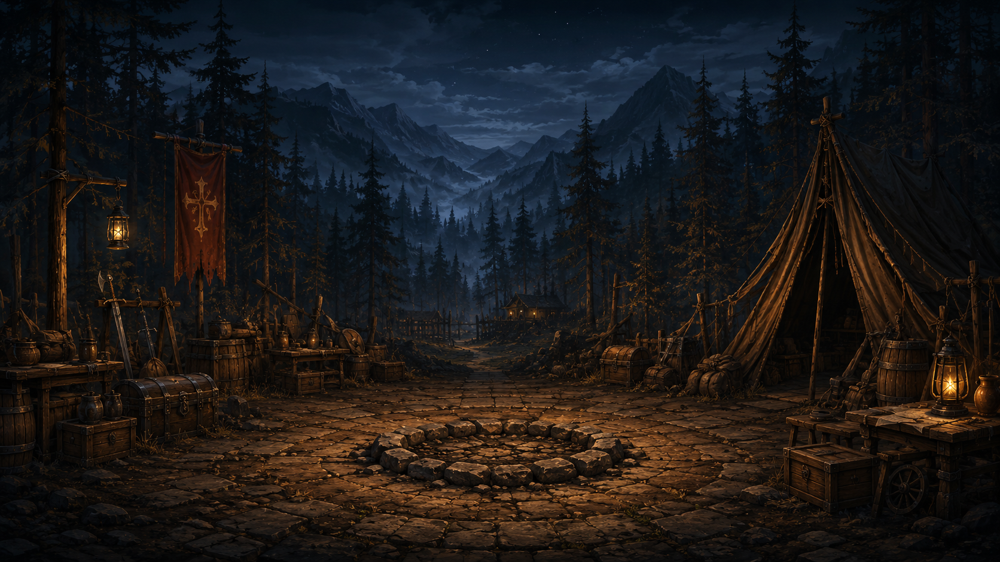
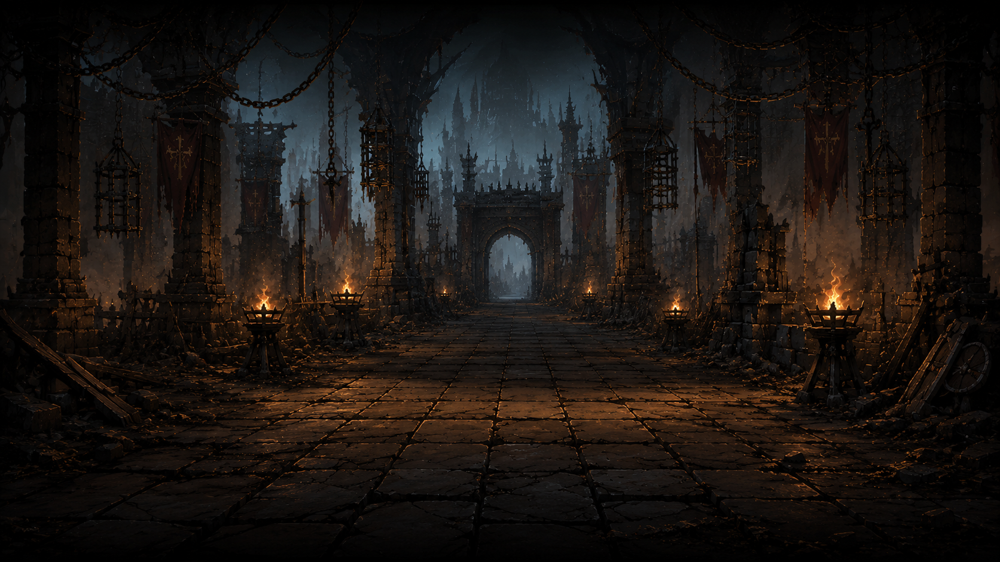
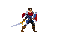
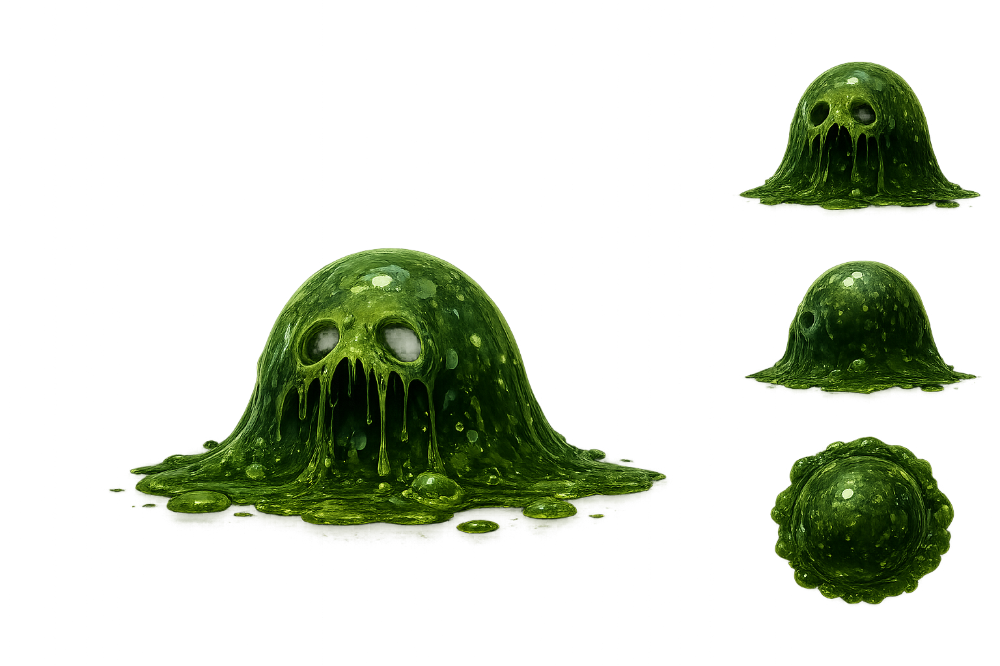

# Delvers

A dungeon-crawler style game built with [Godot 4.6](https://godotengine.org/). Lead your delvers into battle against monsters, with combat resolved by a simulation engine and replayed as animated theater scenes.

## Screenshots

| Main menu | Combat theater |
|-----------|----------------|
|  |  |

| Hero — Default Delver | Enemy — Green Slime |
|-----------------------|---------------------|
|  |  |

## Features

- **Combat simulation** — Heroes and enemies fight using timed auto-attacks, skills, and formation slots. Combat runs headlessly and produces a full event log.
- **Theater playback** — Combat results are replayed visually: actors spawn on the battlefield, attack animations play, damage numbers float up, and deaths are shown.
- **Data-driven units** — Heroes and enemies are defined as Godot resources (`.tres`) with stats, skills, and linked actor scenes.
- **Main menu** — Campfire-themed menu with Enter and Exit actions.

## Game Design

### Vision

Delvers is a party-based dungeon crawler where you send heroes — your *delvers* — into dangerous places and watch them fight. The long-term goal is a full loop of **prepare → delve → fight → recover → repeat**, with tactical depth coming from party composition, formation placement, and skill choices rather than direct real-time control.

### Core Loop (planned)

1. **Camp** — Recruit and equip delvers at the campfire hub.
2. **Delve** — Enter a dungeon and encounter enemy groups.
3. **Combat** — Battles resolve automatically via the simulation engine.
4. **Theater** — Results play back as a staged battle scene.
5. **Rewards** — Collect loot, experience, and progress deeper.

The campfire menu and combat theater are the first pieces of this loop. Dungeon exploration and meta-progression are not yet implemented.

### Combat Design

Combat is **auto-battler** style: units act on attack timers rather than player input. Each entity has:

- **Health and mana** — Base stats from their template resource.
- **Attack interval** — How often they perform their primary skill (e.g. Default Delver attacks every 3s, Green Slime every 4s).
- **Formation slot** — Position on the battlefield, used by the theater layer for visual placement.
- **Skills** — Data-driven abilities with damage ranges, targeting rules, cooldowns, and cast types.

Damage is rolled as `base_attack + random(skill.min_damage, skill.max_damage)`. Heroes target the first living enemy; enemies target the first living hero. Combat ends when one side is wiped out.

A key architectural choice is **separating simulation from presentation**:

```
CombatState (simulate) → CombatLog / CombatResult → TheaterController (replay)
```

This lets combat run instantly in the background (useful for fast-forward, AI testing, or server-side resolution) while the player watches a polished replay. The two layers communicate only through serializable events (`SPAWN`, `DAMAGE`, `DEATH`), keeping them independent.

### Content Pipeline

New units and abilities are added without code changes:

1. Create an **actor scene** in `scenes/theater/actors/` (sprite, animations, HP bar).
2. Define a **template resource** in `resources/heroes/` or `resources/enemies/` (stats, skills, actor link).
3. Define **skills** in `resources/skills/` (damage, targeting, behavior script).
4. Reference them in combat setup or future dungeon encounter tables.

The `SkillDefinition` class already supports attack/spell/support types, cast times, AoE targeting, cooldowns, and custom behavior scripts — most of these are wired up for future skills beyond the current auto-attack.

### Current State vs. Roadmap

| Area | Status |
|------|--------|
| Combat simulation | Working |
| Theater playback | Working |
| Formation slots | Working |
| Main menu | UI only (Enter not yet linked) |
| Dungeon exploration | Not started |
| Loot / progression | Not started |
| Multiple skill types | Schema ready, only auto-attack implemented |
| Sound | Menu audio player present, not wired up |

## Requirements

- [Godot 4.6](https://godotengine.org/download) (Forward Plus renderer)
- No external dependencies

## Getting Started

1. Clone the repository:

   ```bash
   git clone https://github.com/nexzitar/delvers.git
   cd delvers
   ```

2. Open the project in Godot (`project.godot`).

3. Press **F5** (or click Play) to run. The main scene is the menu at `scenes/menus/menu.tscn`.

### Test Scenes

| Scene | Path | What it does |
|-------|------|--------------|
| Combat test | `scenes/testscenes/combat_test.tscn` | Runs a 1v2 fight (Default Delver vs two Green Slimes) and prints the log |
| Theater test | `scenes/theater/theater_test.tscn` | Plays back a combat result on the battlefield with animations |

## Project Structure

```
delvers/
├── art/              # Sprites, UI textures, effects, fonts, backgrounds
├── resources/        # Hero, enemy, and skill definitions (.tres)
├── scenes/
│   ├── menus/        # Main menu
│   ├── theater/      # Battlefield and actor scenes
│   └── testscenes/   # Combat and theater test scenes
└── scripts/
    ├── combat/       # Simulation, entities, events, and results
    ├── data/         # Template classes for heroes, enemies, and skills
    └── theater/      # Visual playback of combat events
```

## How Combat Works

Combat is split into two layers:

1. **Simulation** (`scripts/combat/`) — `CombatState` runs the fight in discrete time steps. Entities attack on intervals, damage is rolled from skill definitions, and every action is recorded as a `CombatEvent` in a `CombatLog`. When one side is eliminated, a `CombatResult` is built.

2. **Theater** (`scripts/theater/`) — `TheaterController` reads the combat log and plays it back: spawning actors via `ActorFactory`, triggering attack/hit/death animations, showing HP bars, and spawning floating damage numbers.

## Current Content

| Type   | ID             | Name           | Stats |
|--------|----------------|----------------|-------|
| Hero   | Default Delver | Default Delver | 100 HP, 10 mana, 1 ATK, 3.0s interval |
| Enemy  | green_slime    | Green Slime    | 25 HP, 1 ATK, 4.0s interval |
| Skill  | auto_attack    | Auto Attack    | 0–9 bonus damage |

## License

This project is licensed under the [MIT License](LICENSE).
