# Delvers

A dungeon-crawler style game built with [Godot 4.6](https://godotengine.org/). Lead your delvers into battle against monsters, with combat resolved by a simulation engine and replayed as animated theater scenes.

## Screenshots

| Main menu | The camp |
|-----------|----------|
| 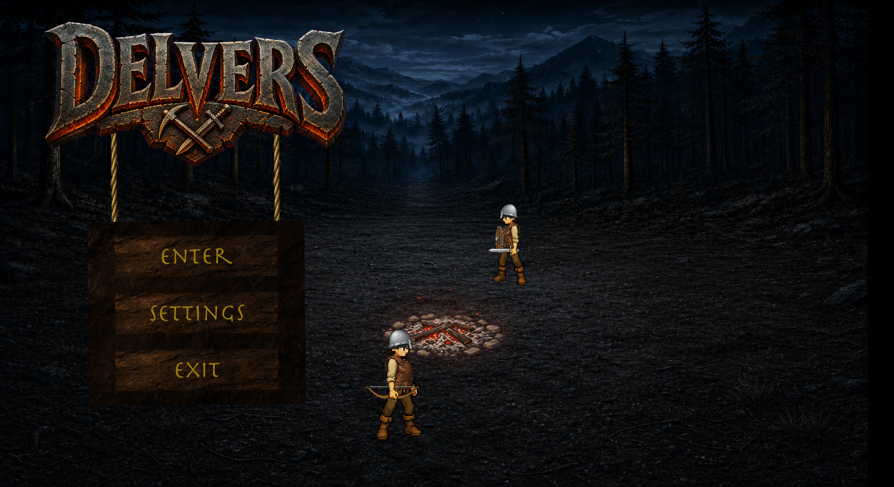 | 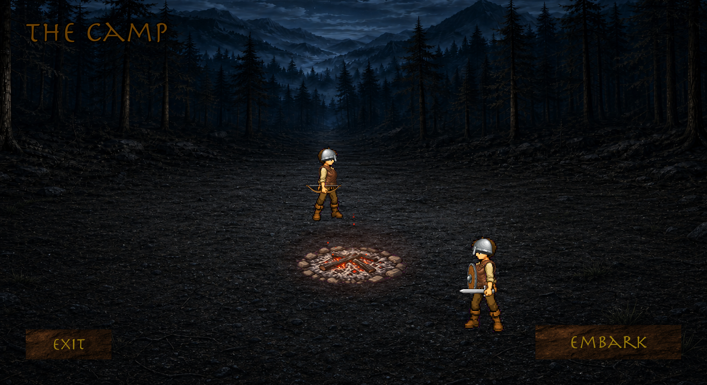 |

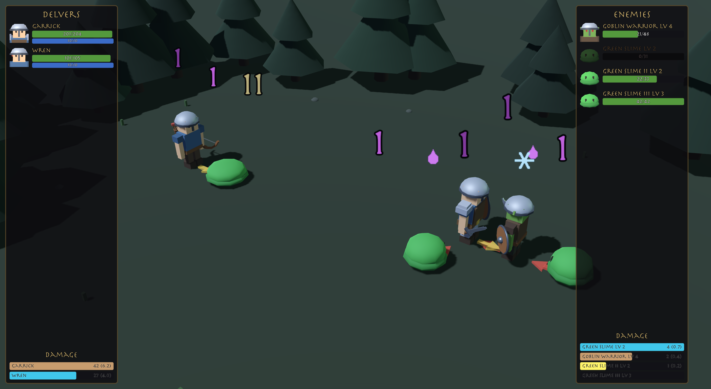

| Hero loadout | Item tooltip |
|--------------|--------------|
| 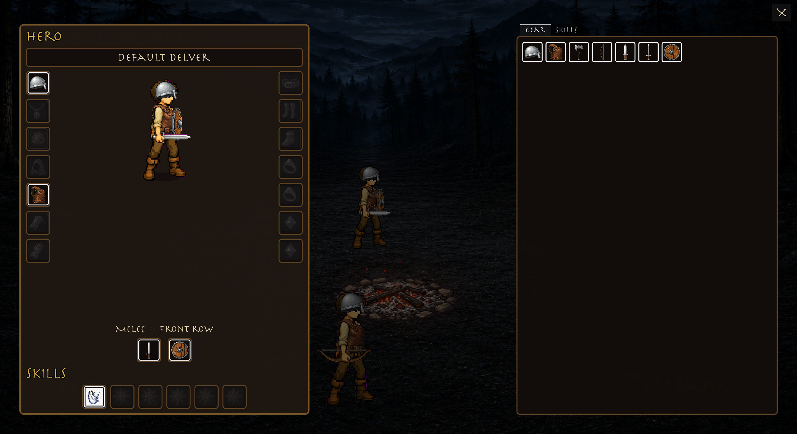 | 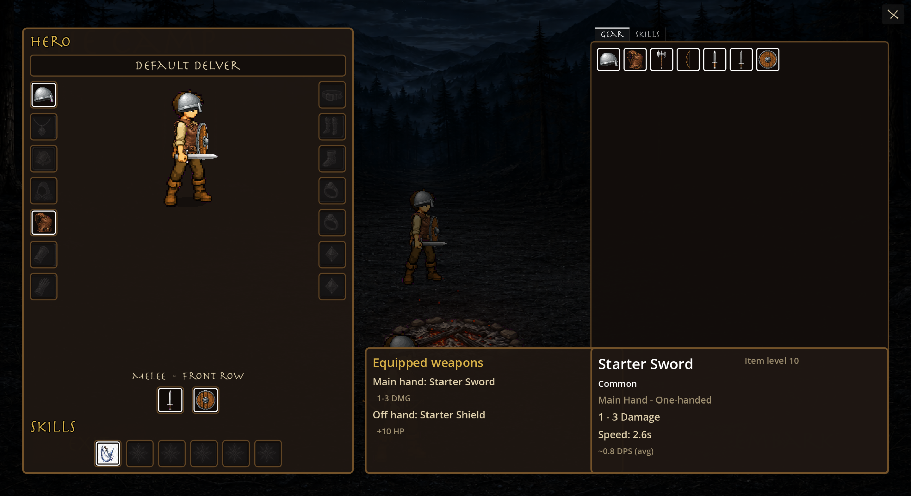 |

| Two-handed weapon blocks the off-hand | Dual-wield |
|---------------------------------------|------------|
| 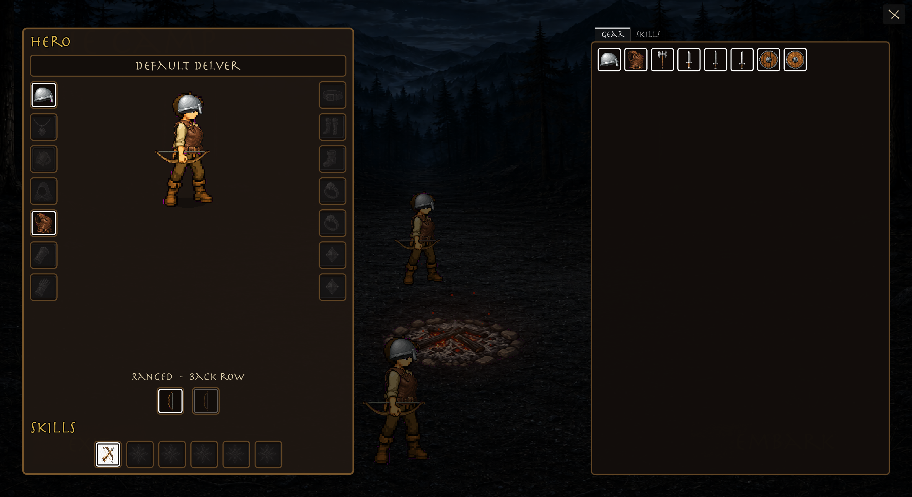 | 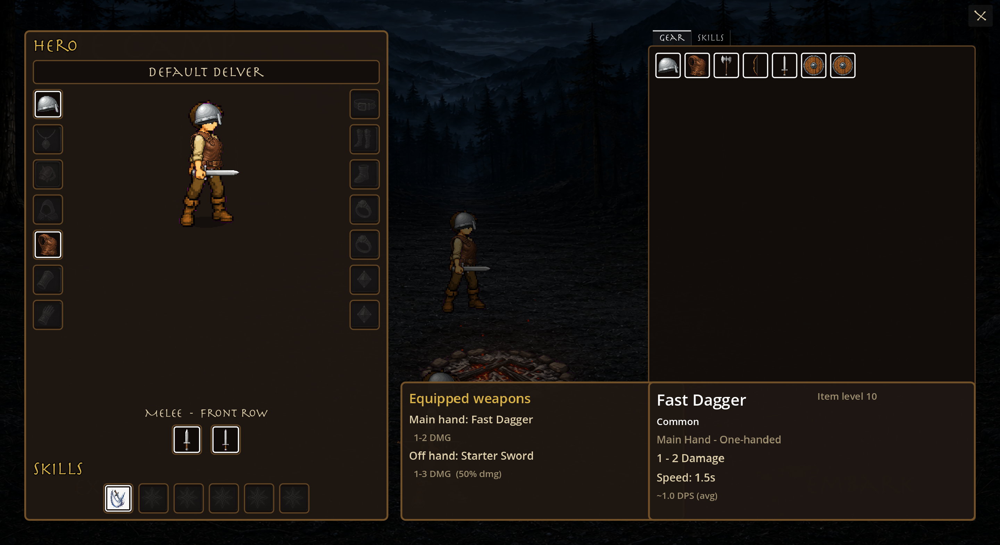 |

| Click-to-carry an item |
|------------------------|
| 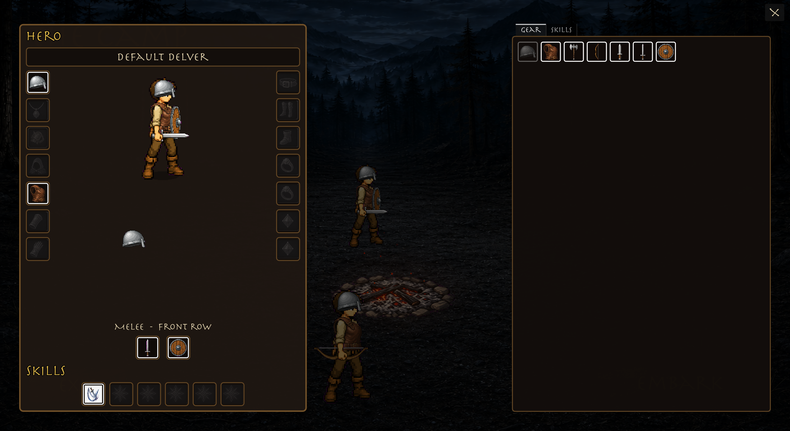 |

## Meet the Cast

| Default Delver (melee) | Default Delver (archer) | Goblin Archer | Green Slime |
|:--:|:--:|:--:|:--:|
| 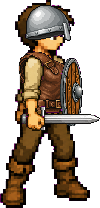 | 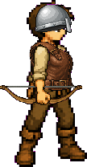 | 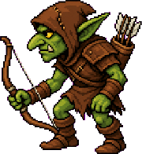 |  |
| Sword-and-board front row | Bow back row | Ranged enemy | Front-row enemy |

## Features

- **Combat simulation** — Heroes and enemies fight using timed auto-attacks, skills, and formation slots. Combat runs headlessly and produces a full event log.
- **Theater playback** — Combat results are replayed visually: actors spawn on the battlefield, attack animations play, damage numbers float up, and deaths are shown.
- **Battle UI** — Side panels show each team's units (portrait, name, health and mana) plus a live damage/DPS meter, keeping the battlefield itself free of floating nameplates.
- **Data-driven units** — Heroes and enemies are defined as Godot resources (`.tres`) with stats, skills, and linked actor scenes.
- **Full game loop** — Main menu → camp → battle → back to camp. The camp and menu share a campfire stage where your unlocked heroes sit at random seats around a smoldering, animated fire that grows with the party's deeds. Entering camp from the menu plays a zoom-and-fade transition, and the party keeps their seats across it.
- **Hero loadout** — Hover a hero at camp for an outline and nameplate, then click to open their loadout: a live paper-doll preview with flanking equipment columns, a weapon row, and a skill row; tabbed gear and skill catalogs; and a shared stash sorted by slot and rarity. Move items by drag-and-drop or click-to-carry (handy on a trackpad). Dropping gear on the hero panel auto-equips it; right-click equips from the stash or unequips worn gear. Weapons show a damage range, swing speed, and average DPS in a two-column tooltip, with equipped-gear comparison in a separate panel. Dual-wielding a one-handed weapon in each hand adds off-hand swings at 50% damage. A bow or two-hander blocks the off-hand slot with a dimmed ghost. Equipping a bow turns a hero into a back-row archer; melee weapons keep them in the front row — changes that carry straight into the next battle.
- **Sound** — Procedurally synthesized placeholder audio: looping menu and combat themes, fire-crackle ambience, a creaking sign, UI hover/click feedback, and combat hits, swings, and bow shots. Mixed through Master/Music/SFX/Ambience buses.
- **Settings** — Fullscreen toggle and four volume sliders, persisted to disk and applied on startup.

## Game Design

### Vision

Delvers is a party-based dungeon crawler where you send heroes — your *delvers* — into dangerous places and watch them fight. The long-term goal is a full loop of **prepare → delve → fight → recover → repeat**, with tactical depth coming from party composition, formation placement, and skill choices rather than direct real-time control.

### Core Loop (planned)

1. **Camp** — Recruit and equip delvers at the campfire hub.
2. **Delve** — Enter a dungeon and encounter enemy groups.
3. **Combat** — Battles resolve automatically via the simulation engine.
4. **Theater** — Results play back as a staged battle scene.
5. **Rewards** — Collect loot, experience, and progress deeper.

The loop's skeleton is in place: from the menu you enter the camp, embark on an adventure (one battle for now), and return to camp with a victory or defeat report. Dungeon exploration and meta-progression are not yet implemented.

### Combat Design

Combat is **auto-battler** style: units act on attack timers rather than player input. Each entity has:

- **Health and mana** — Base stats from their template resource.
- **Attack interval** — How often they perform their primary skill. For heroes, the main-hand weapon's swing speed sets this interval when equipped.
- **Formation slot** — Position on the battlefield, used by the theater layer for visual placement.
- **Skills** — Data-driven abilities with damage ranges, targeting rules, cooldowns, and cast types.

Damage is rolled as `base_attack + random(skill.min_damage, skill.max_damage)` for skills, plus a per-swing weapon damage roll for equipped weapons. Combat ends when one side is wiped out.

**Formations and targeting** — Each side has six named slots in two rows (front/back × top/center/bottom). Units fill their template's preferred row first (melee prefer front, archers prefer back), spreading from the center outwards. Melee attacks must target a random living front-row enemy while any remain; ranged attacks pick a random target from either row.

**Encounters and enemy levels** — Each adventure rolls a random pack of 2–4 enemies. Every enemy rolls a level (mostly 1–2, occasionally 3) that scales its health and attack, with a little individual variance on top, and the level is shown in its name (e.g. *Green Slime Lv 2*).

**Loadout and roles** — A hero's combat role is driven by what they wield. Equipping a bow assigns the Arrow Shot skill and a back-row slot; equipping a one-handed weapon assigns Slash and a front-row slot, and bows/two-handers free the off-hand. Gear lives in a shared stash (each item is a single physical object), skills are a known catalog, and every change a hero makes is read directly off its template by the next battle. Loadout edits persist for the session.

**Weapon speed and dual-wield** — Each weapon has a damage range (e.g. 1–3) and a swing speed in seconds. Per-hit damage is rolled from that range; listed DPS uses the average. Faster weapons hit more often with smaller rolls; slower weapons hit harder per swing. Weapons are tuned so similar item levels land in a comparable DPS band, leaving room for future trade-offs (armor stats, procs, etc.). A one-handed weapon in the off hand swings on the same timer at 50% of its rolled damage, so dual-wielding trades shield or stat slots for extra attacks.

A key architectural choice is **separating simulation from presentation**:

```
CombatState (simulate) → CombatLog / CombatResult → TheaterController (replay)
```

This lets combat run instantly in the background (useful for fast-forward, AI testing, or server-side resolution) while the player watches a polished replay. The two layers communicate only through serializable events (`SPAWN`, `DAMAGE`, `DEATH`), keeping them independent.

### Content Pipeline

New units and abilities are added without code changes:

1. Create an **actor scene** in `scenes/theater/actors/` (sprite, animations, HP bar).
2. Define a **template resource** in `resources/heroes/` or `resources/enemies/` (stats, skills, actor link).
3. Define **skills** in `resources/skills/` (damage, targeting, behavior script).
4. Reference them in combat setup or future dungeon encounter tables.

The `SkillDefinition` class already supports attack/spell/support types, cast times, AoE targeting, cooldowns, and custom behavior scripts — most of these are wired up for future skills beyond the current auto-attack.

### Current State vs. Roadmap

| Area | Status |
|------|--------|
| Combat simulation | Working |
| Theater playback | Working |
| Formation slots | Working |
| Game loop (menu → camp → battle → camp) | Working |
| Hero loadout (equipment, skills, naming) | Working (session-only, no save yet) |
| Camp upgrades / recruiting | Not started |
| Dungeon exploration | Not started |
| Loot / progression | Not started |
| Multiple skill types | Schema ready, only auto-attack implemented |
| Sound | Procedural placeholder audio with settings (no composed music yet) |
| Settings | Fullscreen + volume sliders working |

## Requirements

- [Godot 4.6](https://godotengine.org/download) (Forward Plus renderer)
- No external dependencies

## Getting Started

1. Clone the repository:

   ```bash
   git clone https://github.com/nexzitar/delvers.git
   cd delvers
   ```

2. Open the project in Godot (`project.godot`).

3. Press **F5** (or click Play) to run. The main scene is the menu at `scenes/menus/menu.tscn`.

### Test Scenes

| Scene | Path | What it does |
|-------|------|--------------|
| Combat simulation | `scenes/combat/combat_simulation.tscn` | Runs a headless fight and prints the combat log |
| Battle theater | `scenes/theater/battle_theater.tscn` | Simulates a fight and plays it back on the battlefield with animations |
| Screenshot capture | `capture/shots.tscn`, `capture/cast.tscn`, `capture/loadout_shot.tscn` | Regenerates the README screenshots and unit renders into `docs/screenshots/` |

## Project Structure

```
delvers/
├── art/              # Sprites, UI textures, gear/skill icons, empty-slot art, shaders, fonts
├── audio/            # Procedurally synthesized sounds and music loops
├── capture/          # Harnesses that regenerate the README screenshots
├── docs/             # README screenshots and unit renders (not imported by Godot)
├── resources/        # Hero, enemy, gear, and skill definitions (.tres)
├── scenes/
│   ├── camp/         # Camp scene, campfire stage, animated fire
│   ├── combat/       # Headless combat simulation scene
│   ├── menus/        # Main menu
│   └── theater/      # Battle theater and actor scenes
└── scripts/
    ├── camp/         # Camp, campfire stage, fire, and hero-loadout screen
    ├── combat/       # Simulation, entities, events, and results
    ├── data/         # Template classes for heroes, enemies, gear, and skills
    ├── game/         # Autoloads: roster/loadout, settings, sounds, scene flow
    └── theater/      # Visual playback of combat events
```

## How Combat Works

Combat is split into two layers:

1. **Simulation** (`scripts/combat/`) — `CombatState` runs the fight in discrete time steps. Entities attack on intervals driven by their main-hand weapon speed (or template default when unarmed), damage is rolled from skill definitions plus weapon damage ranges, and every action is recorded as a `CombatEvent` in a `CombatLog`. When one side is eliminated, a `CombatResult` is built.

2. **Theater** (`scripts/theater/`) — `TheaterController` reads the combat log and plays it back: spawning actors, triggering attack/hit/death animations, spawning floating damage numbers, and feeding the side panels (unit health/mana and the damage meters).

## Current Content

| Type   | ID             | Name           | Stats |
|--------|----------------|----------------|-------|
| Hero   | Default Delver | Default Delver | 100 HP, 10 mana, 1 ATK; weapon speed sets interval; front or back row by loadout |
| Enemy  | green_slime    | Green Slime    | 25 HP, 1 ATK, 4.0s interval, front row |
| Enemy  | goblin_archer  | Goblin Archer  | 20 HP, 2 ATK, 3.5s interval, back row, ranged |
| Skill  | auto_attack    | Slash          | 0–9 bonus damage, melee |
| Skill  | arrow_shot     | Arrow Shot     | 1–7 bonus damage, projectile |
| Gear   | starter_sword  | Starter Sword  | Main hand, one-handed, 1–3 dmg, 2.6s speed |
| Gear   | starter_bow    | Starter Bow    | Main hand, bow, 1–4 dmg, 2.8s speed |
| Gear   | fast_dagger    | Fast Dagger    | Main hand, one-handed, 1–2 dmg, 1.5s speed |
| Gear   | heavy_axe      | Heavy Axe      | Main hand, two-handed, 4–9 dmg, 3.4s speed |
| Gear   | starter_shield | Starter Shield | Off hand, +10 HP |
| Gear   | starter_helmet | Starter Helmet | Head, +5 HP |
| Gear   | starter_armor  | Starter Armor  | Chest, +15 HP |

## License

This project is licensed under the [MIT License](LICENSE).
